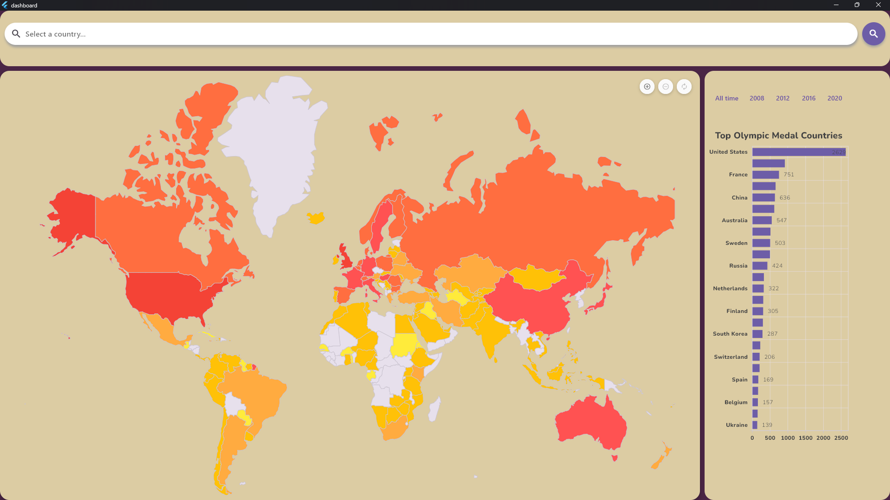
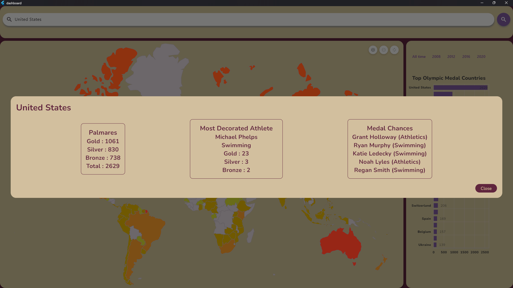

# Dashboard

# Dashboard Flutter Carte du Monde

## À propos du projet

La Carte des Statistiques Olympiques est une application développée avec Flutter, conçue pour offrir une visualisation intuitive et interactive des données sur les performances des différents pays aux Jeux Olympiques d'été. Elle fournit une manière efficace d'accéder et d'analyser des informations statistiques essentielles concernant les médailles, les disciplines sportives sur les éditions récentes des Jeux Olympiques.

## Fonctionnalités

- **Visualisation Cartographique**: Affichage dynamique des performances des pays sur une carte du monde.
- **Données Détailées**: Accès détaillé aux statistiques des médailles par pays et par discipline.
- **Interaction Intuitive**: Navigation fluide et intuitive pour explorer les données.

## Outils et Technologies

- **Flutter** : Utilisé pour le développement de l'interface utilisateur et la logique applicative.
- **Android Studio** : Environnement de développement intégré (IDE) pour la gestion du projet Flutter.

## Captures d'écran

## Équipe de Développement

- Felix Courtin
- Theo Lucq

## Comment utiliser

1. **Installation** : Assurez-vous d'avoir Flutter et Android Studio installés sur votre machine.
2. **Clonez le répertoire** : Clonez ce projet sur votre machine locale.
3. **Ouvrez le projet** : Ouvrez le dossier du projet cloné avec Android Studio.
4. **Exécutez l'application** : Utilisez Android Studio pour exécuter l'application sur un émulateur ou un appareil réel.

## Contribuer

Si vous souhaitez contribuer au projet, veuillez nous contacter ou soumettre une pull request.

---

Nous espérons que vous trouverez ce projet utile et intéressant. Pour toute question ou suggestion, n'hésitez pas à ouvrir une issue ou à nous contacter directement.

